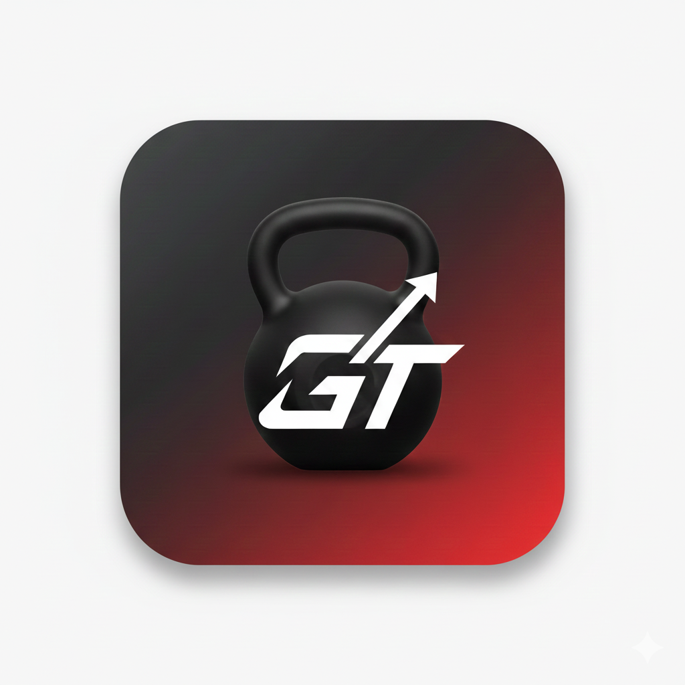

# Gym Tracker (Qt/C++) 🏋️‍♂️

A minimal, privacy-focused workout tracking application built with **Qt 6 (QML & C++)** for Android.

<p align="center">
  
</p>

## Features
* **Track Machines:** Record weight, sets, and reps for specific gym machines.
* **Visual Cards:** Assign images to machines for quick identification.
* **Local Storage:** JSON-based persistence. Data stays on your device (Offline & Private).
* **C++ Backend:** High-performance logic using Qt's AbstractListModel.

## Tech Stack
* **Language:** C++17
* **UI:** Qt Quick (QML)
* **Build System:** CMake
* **Platform:** Android (can be compiled for iOS/Desktop)

## How to Build
1.  Clone the repository:
    ```bash
    git clone git@github.com:YourUsername/GymTracker.git
    ```
2.  Open `CMakeLists.txt` in **Qt Creator**.
3.  Configure for your target (e.g., Android Qt 6.x).
4.  Build and Run.

## License
This project is for educational purposes.
